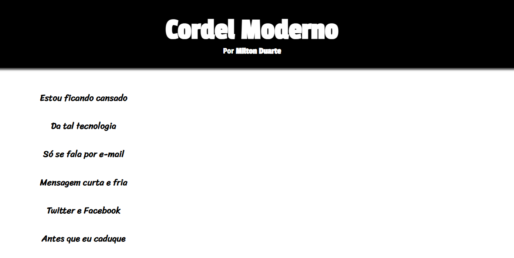
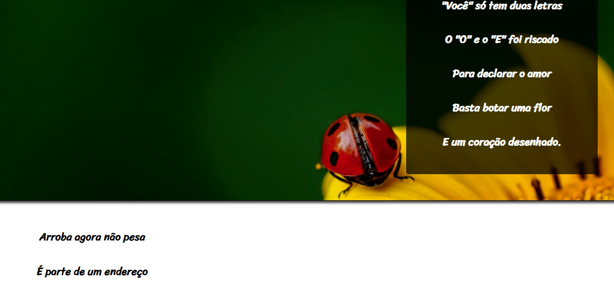

# Curso em Video - Cordel

Challenge proposed by Professor Gustavo Guanaba

## Content

* [Overview](#overview) 
     * [The Challenge](#the-challenge)
* [My Process](#my-process)
     * [Technologies](#technologies)
     * [What I learned](#what-i-learned)
     * [Final Project](#final-project)
* [Author](#author)

## Overview

That was an awesome project using the Parallax effect in the webpage. A honoring mention to [Recanto das Letras](https://www.recantodasletras.com.br/poesias/3186743) for letting me using the poem content from [Milton Duarte](https://www.youtube.com/watch?v=ePPNliWMnoM).

### The Challenge

The challenge was to make a webpage using the Parallax effect as the page goes up and down.

## My Process

The project was divided in three parts:

- HTML structure
    - Semantic tags to separate content over the page;

- CSS Flexbox
    - To organize each content to its right place;

- CSS Style
    - Effect Parallax with `background-attachment: fixed;`

### Technologies

- [HTML5](https://www.w3schools.com/)
- [CSS3](https://www.w3schools.com/css/default.asp)
    - [CSS3 Variables](https://www.w3schools.com/css/css3_variables.asp)
    - [CSS3 Flexbox](https://developer.mozilla.org/pt-BR/docs/Learn/CSS/CSS_layout/Flexbox)

### What I learned

Besides the effect of Parallax, I went through deep thoughts on the poem content as I was organizing the HTML content...
Furthermore, the Parallax effect is widely used nowadays in websites

### Final Project

Initial Screen:

When an image appears:

## Author

- LinkedIn - [Vinicius Duarte](https://www.linkedin.com/in/viniciussouzaduarte/)
- Intagram - [@vinicius_duartesd](https://www.instagram.com/vinicius_duartesd/)
